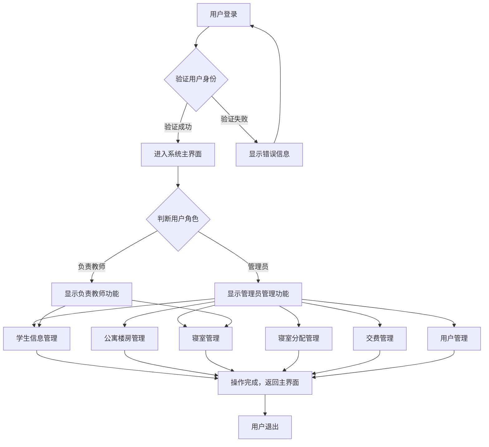

```mermaid
graph TD
    A[用户登录] --> B{验证用户身份}
    B --> |验证成功| C[进入系统主界面]
    B --> |验证失败| D[显示错误信息]
    D --> A
    C --> E{判断用户角色}
    E --> |管理员| F[显示管理员管理功能]
    E --> |负责教师| G[显示负责教师功能]
    
    F --> H[学生信息管理]
    F --> I[公寓楼房管理]
    F --> J[寝室管理]
    F --> K[寝室分配管理]
    F --> L[交费管理]
    F --> M[用户管理]
    
    G --> H[学生信息管理]
    G --> J[寝室管理]
    
    H --> N[操作完成，返回主界面]
    I --> N
    J --> N
    K --> N
    L --> N
    M --> N
    
    N --> O[用户退出]

```